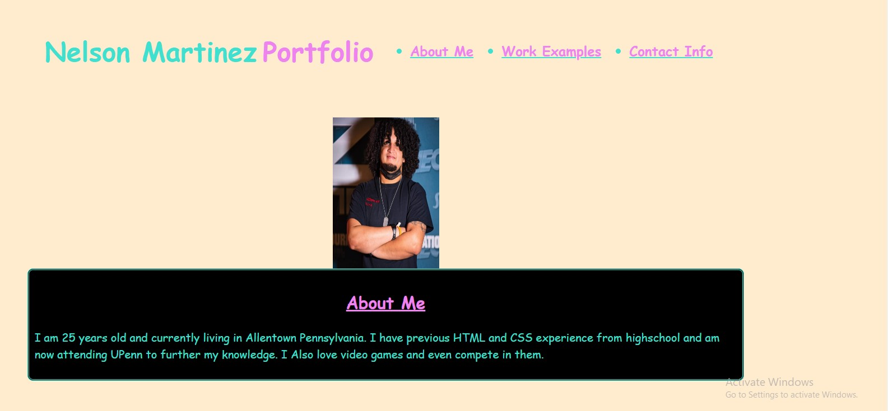

Nelson Martinez's Portfolio

DESCRIPTION

Tried making a portfolio for myself using my knowledge of HTML and CSS.
I tried making sure that all my links worked properly and even tried to decorate alot of my boxes with transitions and hover effects.
I spent hour trying to change the different displays but couldn't get my work spaces to align as I wanted to. I did learn how to add screenshots to my webpage through HTML and CSS.

